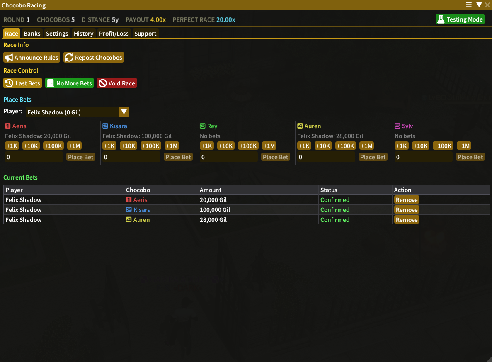
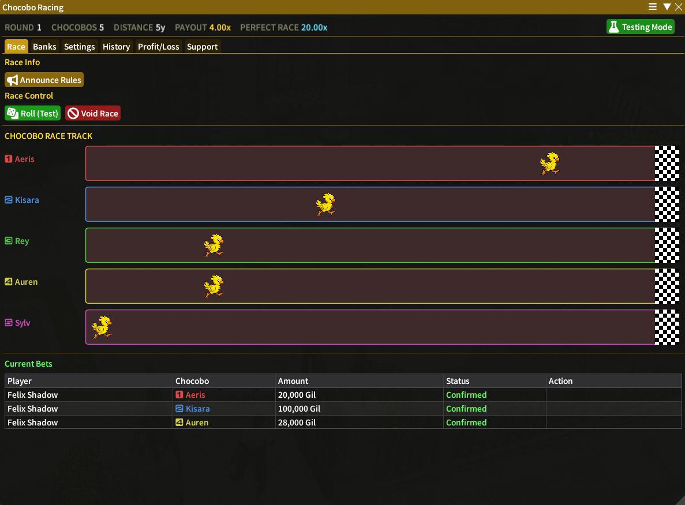
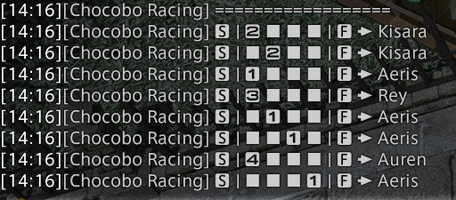
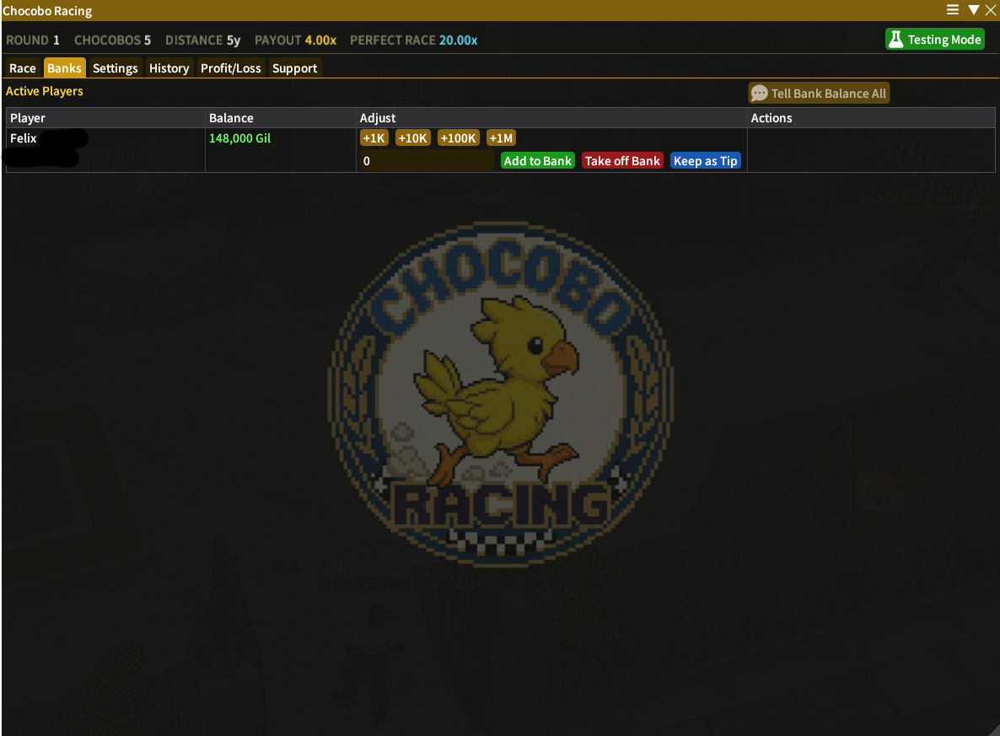
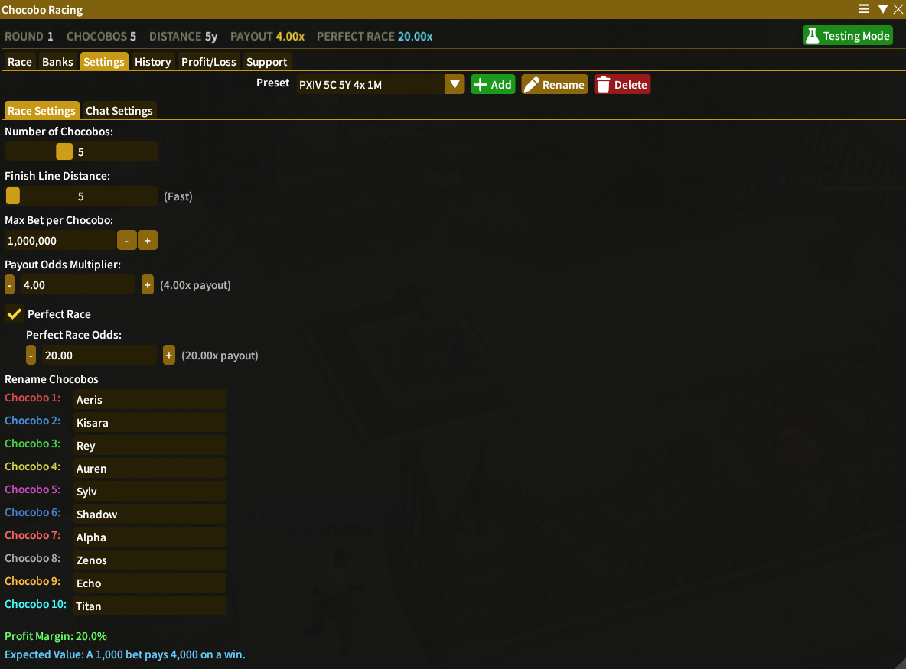
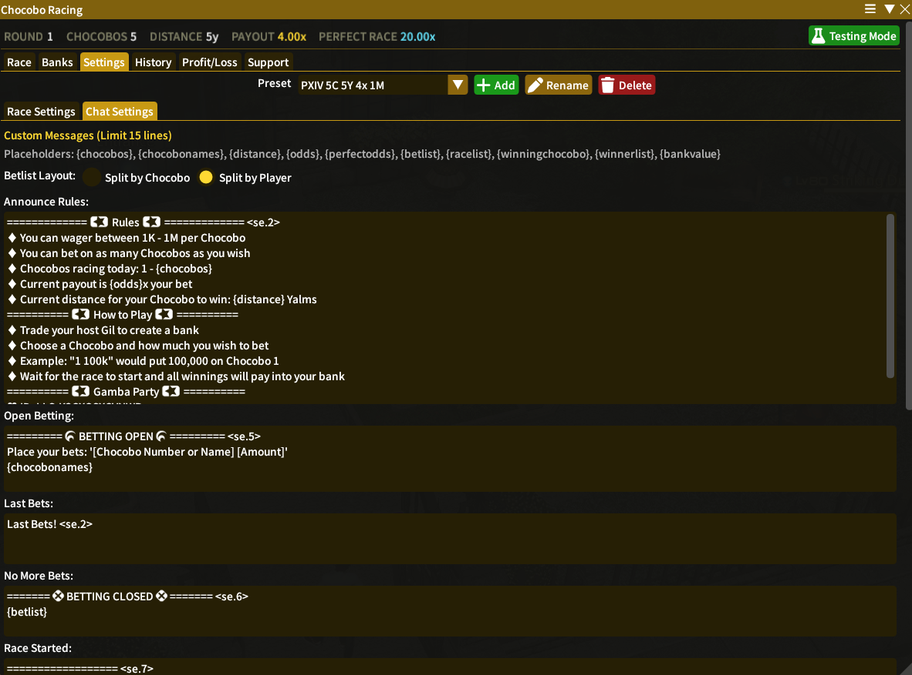
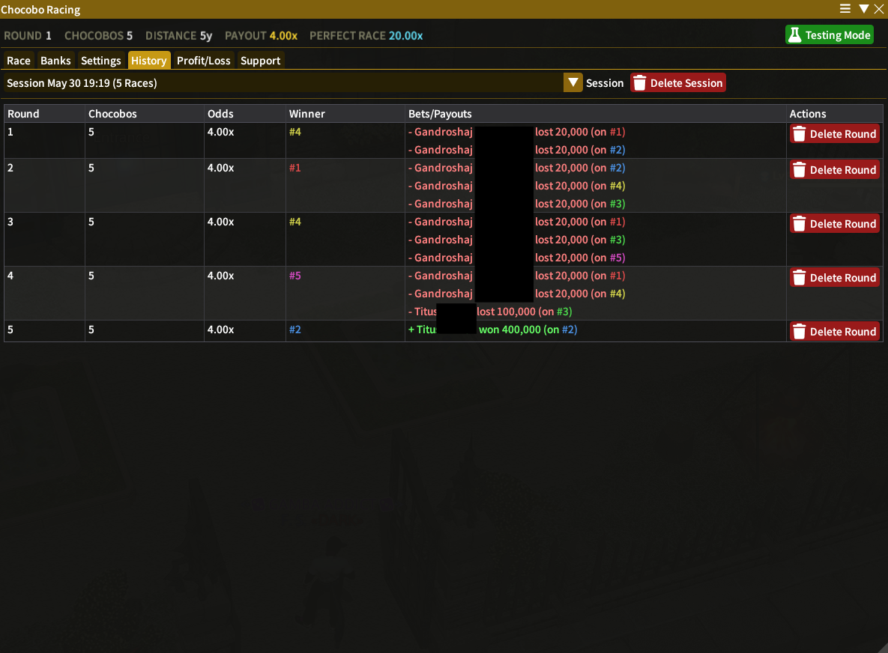
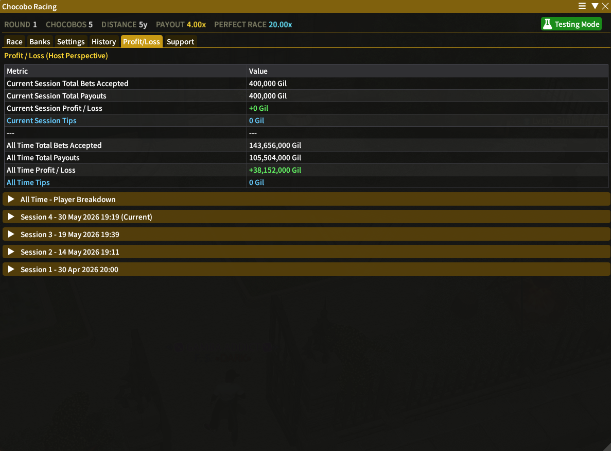
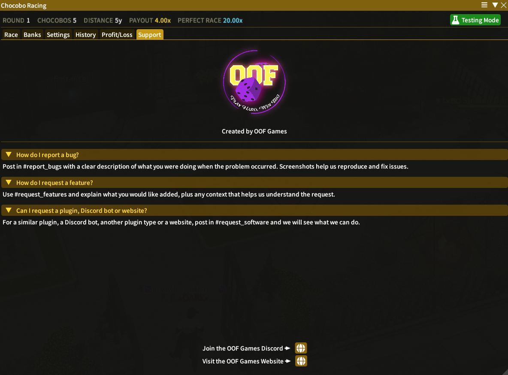

# Chocobo Racing

Everything you need to run a live Chocobo Racing event at your FFXIV venue - no spreadsheets, no missed bets, no manual bookkeeping.

`Chocobo Racing` is a Dalamud plugin built for hosts and venues. Players bet on a chocobo, the host uses `/dice` to advance each bird along the track, and the plugin handles bet capture, bank tracking, and payout calculation automatically from start to finish.

## What It Does

- **Automatic bet detection**: Reads party and alliance chat in real time and logs every bet the moment it is typed, so no manual bookkeeping is ever needed from the host.
- **Integrated bank system**: Each player's balance is tracked automatically, with a one-click trade button to take or pay out gil and a private tell button to send any player their current funds.
- **Console and vanilla client friendly**: All race commentary and results are posted directly to in-game chat so console players and unmodded clients can follow every moment without extra software.
- **Scalable race size**: Run head-to-head duels with two chocobos or grand prix events with up to ten birds, configurable before each race from the Settings tab.
- **Adjustable track length**: Set the finish line anywhere between 5 and 15 yalms to tune races for fast sprints or longer, tension-building events.
- **Decimal payout odds**: Assign precise fractional odds per chocobo to control your house edge, with automatic payout calculation applied at the end of each race.
- **Customisable chat profiles**: Every automated message the plugin sends to chat can be edited to match your venue's tone and theme, with different profiles saved per venue.
- **Full race history and reporting**: A complete log of every race, bet, and payout is stored for review, alongside a profit and loss tracker so hosts can monitor margins over time.

## Commands

- `/chocoboracing` - Open the main plugin window.
- `/cr` - Alias for `/chocoboracing`.
- `/chocoboracingconfig` - Open directly to the settings tab.

## Interface

### Race Tab

The central control panel for taking and recording bets. Use the race control buttons to open and close betting, and the rules announcement buttons to post your rule set to chat. Once the race starts the tab transforms into a live racetrack so you can watch each bird advance in real time as dice are called. When the race concludes the tab displays the winners, their winnings, and their updated bank balance. Payouts are processed from the Banks tab.

### Banks Tab

A table of every player in your party or alliance. Collect entry fees and store them into each player's bank, with options to add funds, remove them, or keep an amount as a tip. Tell buttons let you send any player a private message with their current balance, the trade button opens a trade window to take or pay out gil, and the auto payout button handles bulk payouts for larger winning amounts.

### Settings Tab

Split into two sub-tabs. **Race Settings** is where you configure the number of chocobos, track length, and payout odds before each event. **Chat Settings** is where you can edit every automated message the plugin posts to in-game chat so race commentary matches your venue's voice and style.

### History Tab

A complete log of every race run, showing each entrant, the chocobo they backed, the amount wagered, and the final result. Useful for reviewing individual sessions, settling disputes, or understanding betting patterns across your events.

### Profit/Loss Tab

A running summary of your net position across all sessions, breaking down total bets taken, total payouts made, and your overall margin so you can track performance over time and calculate any percentage fees owed to your venue owner.

### Support Tab

A built-in help section covering common setup questions and troubleshooting steps, with a Discord link that connects you directly to the Chocobo Racing support channel for anything not covered there.

## How to Install Chocobo Racing

1. Type `/xlsettings` in the in-game chat to open the Dalamud settings window.
2. Go to the **Experimental** tab.
3. Paste this link into the **Custom Plugin Repositories** field at the bottom:

   `https://puni.sh/api/repository/oof-games`

4. Click the `+` button, ensure the repository is set to **Enabled**, and click **Save and Close**.
5. Type `/xlplugins`, search for **Chocobo Racing**, and click **Install**.

## Want to get help or get involved?

Join the [OOFGames Discord](https://discord.gg/vM6ff4h5Ym) for support and updates!
